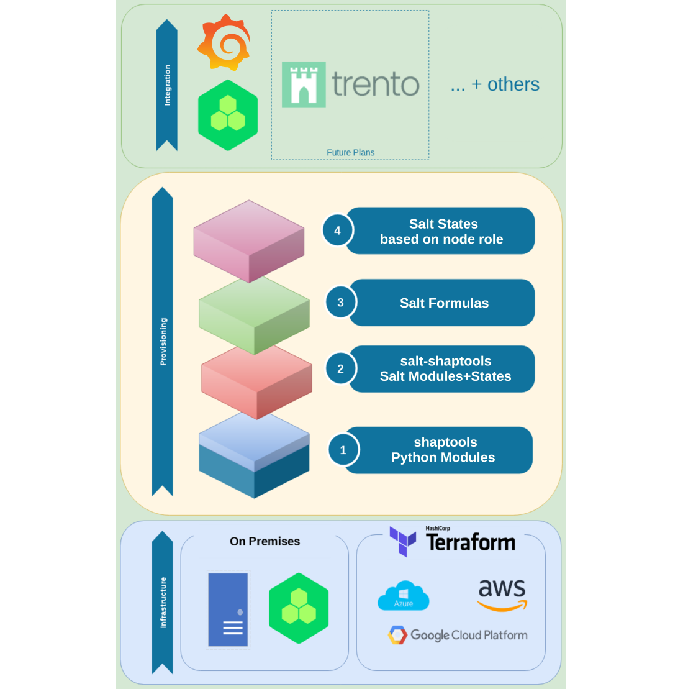

# Automated SAP/HA Deployments in Public and Private Clouds with Terraform

[](https://github.com/SUSE/ha-sap-terraform-deployments/actions)

**Supported terraform version  `1.1.X`**

* [About](#about)
* [System performance and benefits](#system-performance-and-benefits)
   * [Components](#components)
   * [Features](#features)
   * [Products and Cloud Providers](#products-and-cloud-providers)
* [Project Structure](#project-structure)
* [Getting started](#getting-started)
* [Troubleshooting](#troubleshooting)

___

# About

This Project provides a high configurable way to deploy **SAP HANA**
database and **SAP S/4HANA** (or **SAP NetWeaver**) on various
cloud platforms. Both public cloud and private cloud scenarios are
possible. The major big cloud providers _Google Cloud Platform_
(GCP), _Microsoft Azure_, and _Amazon Web Services_ (AWS) are
supported.  Furthermore _OpenStack_ and _libvirt/KVM_ can be used.


# System performance and benefits


The diagram above shows components for an example setup. Several
features can be enabled or disabled through configuration options to
control the behavior of the HA Cluster, the SAP HANA and SAP S/4HANA
or SAP NetWeaver.

## Components

 - _SAP HANA environment_: The SAP HANA deployment is configurable. It
   might be deployed as a single SAP HANA database, a dual
   configuration with system replication. In addition a HA cluster can
   be set in top of that. Also see [Preparing SAP software](doc/sap_software.md)

 - _SAP NetWeaver_ environment: with ASCS, ERS, PAS and AAS instances
   can be deployed using SAP HANA database as storage. For more
   information see [S/4HANA and NetWeaver](doc/netweaver.md).

 - _ISCSI server_: provides Stonith Block Devices used by the
   _sbd fencing_ mechanism. Also see [Fencing mechanism](doc/fencing.md)
   _Native fencing_ mechanisms are available for some cloud environments.

 - _Monitoring services server_: The monitoring solution is based on
   [prometheus🔗](https://prometheus.io) and
   [grafana🔗](https://grafana.com/) and provides informative and
   customizable dashboards to users and administrators. For
   more information see [Monitoring of cluster](doc/monitoring.md).

 - _DRBD cluster_: is used to provide a highly available NFS server.
   It will be used to mount SAP NetWeaver shared files. For more
   information see [DRBD](doc/drbd.md).
   Some clouds provide native solutions for high available NFS.

For more on various topics have a look on the following documentation:

   - [SUSE saptune](doc/saptune.md)
   - [IP addresses auto generation](doc/ip_autogeneration.md)

## Features

  …

## Products and Cloud Providers

This repository supports deployment with following products and SAP certified providers:

| Vendor    | Product                                                  | Certification                     |
| --------- | -------------------------------------------------------- | --------------------------------- |
| SAP       | SAP NETWEAVER 7.5 (and later)                            |
| SAP       | SAP S/4HANA 1610, 1709, 1809, 1909, 2020, 2021           |
| SUSE      | SUSE Linux Enterprise Server for SAP Applications 12 SP5 | [SLES for SAP🔗](https://www.suse.com/products/sles-for-sap/), <br> [SAP Process Automation🔗](https://store.sap.com/dcp/en/product/display-0000059520_live_v1/SUSE%20Linux%20Enterprise%20Server%20for%20SAP%20applications)  |
| SUSE      | SUSE Linux Enterprise Server for SAP Applications 15 SP3 | see links above                   |
| Amazon    | Amazon Web Services (AWS)                                | [IaaS for AWS🔗](https://www.sap.com/dmc/exp/2014-09-02-hana-hardware/enEN/#/solutions?filters=ve:23)  |
| Microsoft | Azure⁺                                                   | [IaaS for Azure🔗](https://www.sap.com/dmc/exp/2014-09-02-hana-hardware/enEN/#/solutions?filters=ve:24)  |
| Google    | Google Cloud Platform (GCP)                              | [IaaS for GCP🔗](https://www.sap.com/dmc/exp/2014-09-02-hana-hardware/enEN/#/solutions?filters=ve:29)  |
|           | OpenStack                                                |                                   |
|           | Libvirt                                                  |                                   |

  ⁺ Be carreful with Azure, **clustering** means scale-out scenario


# Project Structure

This project heavily uses [terraform🔗](https://www.terraform.io/) and
[salt🔗](https://www.saltstack.com/) for configuration and deployment.

**Terraform** is used to create the required infrastructure in the specified cloud.

The code is divided into sub directores for each terraform provider and 
split into different terraform modules. There are also some abstracted _generic_modules_

```
./ha-sap-terraform-deployments
├── aws
│    └── modules
├── azure
│    └── modules
├── generic_modules
│    └── ...
├── gcp
│    └── modules
├── libvirt
│    └── modules
├── openstack
│    └── modules
…
```

This makes the code modular and more maintainable.

**Salt** configures all virtual machine instances that are provisioned by terraform.
This includes configuring the operating system, mounting filesystems,
installing SAP software, installing HA components.
It does so by using pillars/grains which are injected by terraform
in a flexible and customizable way.

```
./ha-sap-terraform-deployments
├── pillar_examples
│    └── automatic
│        └── drbd
│        └── hana
│        └── netweaver
├── salt
│    └── bastion
│    └── cluster_node
│    └── ...
…
```

Under the hood, [shaptools🔗](https://github.com/SUSE/shaptools) and [salt-shaptools🔗](https://github.com/SUSE/salt-shaptools) are used, to have a stable API to access
SAP HANA and Netweaver functionalities.

The whole architecture stack can be seen here:




This repository is intended to be configured and run from a local
computer. Terraform will then build up the infrastructure and
machines. The SAP software media will be installed from a storage and
configured after.


**Each provider folder has it own provider relevant documentation,**
**modules and example configuration.**


# Getting started 


First make sure to have terraform and salt installed. Clone this
repository and follow the quickstart guides of the favored provider.
They can be found in `./<provider/README.md>` or linked below:

  - [Microsoft Azure](azure/README.md#quickstart)
  - [Google Cloud Platform (GCP)](gcpazure/README.md#quickstart)
  - [Amamazon Web Services (AWS)](aws/README.md#quickstart)
  - [OpenStack](openstackaws/README.md#quickstart)
  - [libvirt/KVM](libvirtaws/README.md#quickstart)

Each provider folder contains a minimal working configuration example
`terraform.tfvars.example`.

**Please be careful which instance type you will use! The selection of
systems certified by SAP could lead to expensive unexpected costs.**


# Troubleshooting

In case you have some issue, take a look at this [troubleshooting guide](doc/troubleshooting.md).

